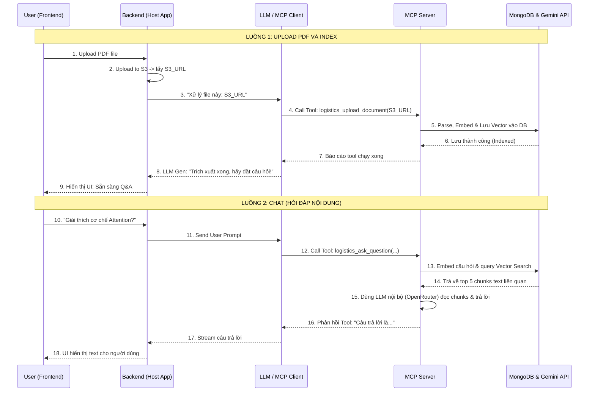

# Quy trình tích hợp MCP Server vào Web App (RAG & Web Upload Flow)

Tài liệu này mô tả kiến trúc và luồng dữ liệu (data flow) từ Frontend (giao diện người dùng) đến Backend (Host App) và cách **Logistics MCP Server** của chúng ta đóng vai trò xử lý lõi như thế nào khi bạn upload một file PDF và đặt câu hỏi về nó.

---

## 1. Kiến trúc tổng quan (Architecture)

1. **Frontend (FE):** Giao diện Web (React/Vue/Next.js). Quản lý UI Chat, nút Upload file, hiển thị tin nhắn.
2. **Backend (BE - Host Application):** Máy chủ Web tĩnh của bạn (Node.js/Python). Đóng vai trò là **MCP Client**, gọi đến các mô hình LLM chính (như Claude Desktop, OpenAI) và kết nối với MCP Server.
3. **Logistics MCP Server:** Là server bạn vừa xây dựng. Chứa logic nghiệp vụ cốt lõi (Tools): parse PDF, lưu S3, chunking, tính toán Vector Embedding, thao tác với MongoDB Atlas, thực hiện RAG.

---

## 2. Luồng 1: Người dùng Upload File PDF

### Bước 1: Giao diện FE (User Interface)
- Người dùng chọn file PDF và bấm nút Upload hoặc kéo thả vào khung chat.
- Giao diện có thể hiển thị thanh progress bar (đang tải...).

### Bước 2: Logic FE
- **Upload File:** Web App thường không gửi hẳn file qua tin nhắn chat. FE sẽ gửi file đó lên Backend của bạn, hoặc upload thẳng lên AWS S3 (thông qua Pre-signed URL) để lấy về một đường link URL tĩnh (Ví dụ: `https://s3.../my-file.pdf`).
- Sau khi có URL, FE gửi một tin nhắn ẩn hoặc tin nhắn hệ thống (system prompt) tới BE Chat API: *"Tôi vừa tải lên một tài liệu tại URL: `[file_url]`, định dạng `pdf`. Hãy xử lý nó."*

### Bước 3: Backend (Host App) & LLM Client
- Backend nhận được tin nhắn từ FE, nó sẽ chuyển tiếp nguyên văn đoạn hội thoại này cho LLM (vd: Claude 3.5 Sonnet).
- Bằng cách phân tích ngữ cảnh, LLM nhận ra nó cần dùng công cụ. Nó sẽ kích hoạt công cụ (tool call) có tên là `logistics_upload_document` mà **MCP Server** đã cung cấp.

### Bước 4: MCP Server hoạt động
- **MCP Server** nhận lệnh gọi tool `logistics_upload_document` với tham số `fileUrl` và `type="pdf"`.
- Thực thi luồng code trong `document.service.ts`:
  1. Tải file Buffer từ định dạng URL về local.
  2. **Parse Text cục bộ:** Sử dụng `pdf-parse` để đọc toàn bộ chữ.
  3. **Chunking:** Cắt chữ thành các đoạn nhỏ (chunk ~ 1000 ký tự).
  4. **Embedding:** Gửi từng chunk sang Gemini API để biến thành vector (3072 chiều).
  5. **Indexing:** Lưu text và vector vào MongoDB.
- MCP Server trả kết quả báo cáo thành công về cho LLM: `"Success: Document indexed with 50 chunks."`

### Bước 5: Phản hồi về FE
- LLM tổng hợp kết quả và trả về Backend một câu thân thiện: *"Tôi đã tải, đọc và học thuộc tài liệu PDF của bạn. Bạn muốn hỏi gì về nó?"*
- Backend đẩy câu này qua WebSocket (hoặc REST) về Frontend để render lên màn hình Chat.

---

## 3. Luồng 2: Hỏi đáp về nội dung file (Q&A / RAG)

### Bước 1: FE Giao diện & Logic
- Người dùng gõ vào ô chat: *"Cơ chế Attention trong tài liệu tôi vừa gửi là gì?"*
- FE gửi đoạn string này qua API `/api/chat` xuống BE.

### Bước 2: Backend & LLM Client
- BE gắn câu hỏi này vào bộ nhớ hội thoại và gửi cho mô hình LLM.
- LLM tự hiểu đây là câu hỏi cần tra cứu kiến thức Logistics/Tài liệu. Lần này, nó gọi tool `logistics_ask_question` (hoặc `logistics_search_knowledge`) từ **MCP Server**.

### Bước 3: MCP Server hoạt động (Retrieval-Augmented Generation)
- **MCP Server** nhận tool `logistics_ask_question(question="Cơ chế Attention...")`.
- Nó chạy hàm logic trong `intelligence.service.ts` / `search.service.ts`:
  1. Đem mảng từ khóa đi mã hóa vector (Gọi Gemini API lấy vector 3072 chiều của câu hỏi).
  2. Truy vấn **MongoDB Atlas Vector Search** để so sánh khoảng cách chéo (Cosine Similarity) với các chunk PDF đã lưu.
  3. Lấy ra top 5 đoạn text (chunks) liên quan nhất.
  4. Ráp 5 đoạn text đó với câu hỏi ban đầu thành một prompt lớn chứa "Ngữ cảnh / Bối cảnh".
  5. Gửi prompt khổng lồ đó cho mô hình LLM RAG (OpenRouter) để yêu cầu nó tóm tắt và đưa ra câu trả lời cuối cùng cho người dùng.
- Trả đáp án văn bản thuần (vd: "Attention là cơ chế tập trung vào...") về cho quá trình MCP Tool call.

### Bước 4: Render trên FE
- LLM (Host) nhận câu trả lời dạng text hoàn chỉnh từ MCP Server, không sửa gì nhiều và đẩy trả thẳng nó xuống Backend.
- Backend stream response (SSE) lên Frontend.
- Nguời dùng nhìn thấy câu trả lời xuất hiện dần dần trên màn hình cùng các trích dẫn (citations) nếu có.

---

## 4. Tóm tắt bằng Sơ đồ (Sequence Diagram)

## Ưu điểm của kiến trúc chia tách này:
1. **Đóng gói hoàn hảo (Encapsulation):** Web App (FE + BE) của bạn không cần biết code PDF-parse viết ra sao, không cần cài thư viện Database hay quản lý Vector. Rất gọn nhẹ!
2. **Khả năng LLM tự chọn (Autonomy):** LLM tự quyết định khi nào cần tìm kiếm kiến thức bằng MCP (hỏi ngoài lề thì nó không gọi tool mcp, hỏi đúng logistics nó mới gọi tool).
3. **Mở rộng đa nền tảng:** Bạn có thể cắm MCP Server này không chỉ vào Web App mà còn vào Claude Desktop, Slack Bot, Discord Bot v.v. mà logic hoàn toàn giữ nguyên.

---
*🔗 Liên kết (Knowledge Graph Links):*
* Triển khai code: [Integrating MCP to Web App](./07-webapp-integration-guide.md)
* Thiết kế hệ thống lõi: [Document Flow Core](../01-architecture-document-flow.md)
* Trở về: [README](../README.md)