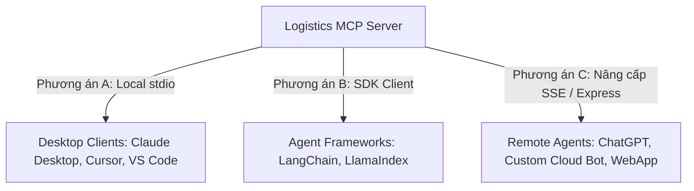

# Hướng Dẫn Tích Hợp Logistics MCP Server Với Ứng Dụng Desktop & AI Agents

Tài liệu này cung cấp giải pháp toàn diện để kết nối **Logistics MCP Server** (hiện đang chạy trên giao thức `stdio`) với các ứng dụng Desktop (Claude Desktop, Cursor, VS Code) và các khung tác tử AI (AI Agent Frameworks như LangChain, LlamaIndex, CrewAI, AutoGen).

---

## 🗺️ Bản Đồ Kiến Trúc & Tài Liệu (Knowledge Graph)
Để dễ dàng theo dõi dạng đồ thị (Graph view trong Obsidian/VS Code/GitHub), bạn có thể chuyển hướng giữa các tài liệu bằng các liên kết sau (Wiki Links):
- 🏗️ **Kiến trúc & Luồng dữ liệu:** [Document Flow Core](./01-architecture-document-flow.md) | [Quy trình Web App](./06-webapp-integration-architecture.md)
- 🔌 **Tích hợp Web App:** [Web App Implementation Guide](./07-webapp-integration-guide.md)
- 🖥️ **Kết nối Desktop & Agent:** [Desktop & Agent Integration Guide](./08-mcp-desktop-and-agent-integration.md) (Tài liệu này)
- 🔙 **Trở về trang chính:** [README](../README.md)

---

## 1. Phân Tích Vấn Đề Hiện Tại (Current Problem Analysis)

Hiện tại, **Logistics MCP Server** của bạn đã được dựng thành công và chạy trên giao thức truyền dẫn **`stdio` (Standard Input/Output)** qua cổng kết nối MCP. 

> [!WARNING]
> **Hạn chế lớn nhất của giao thức `stdio`:**
> - Chỉ hoạt động cục bộ (local subprocess). Tiến trình Client (ví dụ: Claude Desktop) sẽ trực tiếp khởi tạo và giao tiếp qua input/output stream của tiến trình Server.
> - **Không thể truy cập trực tiếp từ xa:** Các AI Agent chạy trên Cloud (như OpenAI Custom GPT, Flowise, Dify) hoặc các ứng dụng khác không nằm trên cùng một máy tính sẽ **không thể** kết nối trực tiếp đến cổng `stdio` này.

Do đó, để mở rộng kết nối cho mọi kịch bản, chúng ta cần phân loại rõ ràng cách tiếp cận cho từng loại Client (Desktop App local vs. Cloud/Local Agents).

---

## 2. Giải Thế Đúng Yêu Cầu (Requirements Clarification)

Bạn cần kết nối cổng MCP này với 2 nhóm đối tượng chính:
1. **Desktop Applications (Ứng dụng máy tính):** 
   - **Claude Desktop:** Chat trực tiếp với Claude và cho phép Claude gọi các công cụ logistics của bạn để tìm kiếm file, upload PDF, phân tích workflow.
   - **Cursor IDE:** Hỗ trợ lập trình viên chat trực tiếp và tự động gọi tool từ MCP ngay trong trình soạn thảo code.
   - **VS Code:** Sử dụng các tiện ích mở rộng như **Roo Code (Cline)** hoặc **Continue** để biến VS Code thành một Agent hỗ trợ viết code/phân tích.
2. **AI Agents / Agentic Frameworks (Các khung tác tử AI):**
   - **LangChain (Node.js & Python):** Cho phép các chuỗi lập luận phức tạp tự chọn và thực thi tool của bạn.
   - **LlamaIndex:** Sử dụng MCP Server làm Tool Spec cho RAG Agent.
   - **Custom Agents / Remote Clients:** Các chatbot, hệ thống tự động hóa qua Telegram/Web cần tương tác qua mạng.

---

## 3. Phương Án Giải Quyết (Solution Options)

Chúng ta có 3 phương án cốt lõi tương ứng với các kịch bản:



### Phương án A: Tích hợp Local stdio (Dành cho Desktop Client)
- **Cơ chế:** Khai báo đường dẫn tuyệt đối tới build file (`dist/index.js` hoặc `build/index.js`) của MCP Server trong file cấu hình của Desktop Client.
- **Ưu điểm:** Cực kỳ nhanh, không cần chỉnh sửa bất kỳ dòng code nào trên Server. Cắm và chạy ngay lập tức.

### Phương án B: Tích hợp qua SDK (Dành cho Local Agents)
- **Cơ chế:** Sử dụng thư viện `@modelcontextprotocol/sdk` (JS/TS) or `mcp` (Python) để tự viết một Client siêu nhỏ trong ứng dụng Agent của bạn. Client này sẽ spawn tiến trình MCP Server làm subprocess và expose danh sách công cụ cho Agent.
- **Ưu điểm:** Kiểm soát hoàn toàn luồng xử lý và dữ liệu bảo mật tuyệt đối.

### Phương án C: Hỗ trợ Hybrid Transport (Stdio + SSE Server)
- **Cơ chế:** Nâng cấp file `src/index.ts` của MCP Server để tự động phát hiện tham số. Nếu truyền thêm tham số `--port <PORT>`, Server sẽ tự khởi chạy một **Express Server + SSE (Server-Sent Events) Transport** thay vì `stdio`.
- **Ưu điểm:** Biến MCP Server thành một API Web Service trực tuyến, cho phép **bất kỳ AI Agent nào ở bất kỳ đâu trên thế giới** kết nối đến thông qua HTTP/SSE.

---

## 4. Đề Xuất Ưu Tiên (Priority Proposals)

Để triển khai hiệu quả và nhanh chóng có sản phẩm chạy thử, chúng tôi đề xuất thứ tự ưu tiên như sau:

| Độ ưu tiên | Nhiệm vụ | Lý do | Trạng thái |
| :--- | :--- | :--- | :--- |
| **Độ ưu tiên 1 (Critical)** | **Cấu hình Desktop Clients (Claude Desktop & Cursor)** | Giúp bạn kiểm thử thực tế ngay lập tức các Tool (như `logistics_upload_document` và `logistics_ask_question`) trực quan trên giao diện UI chat cao cấp. | Cần cấu hình file JSON |
| **Độ ưu tiên 2 (High)** | **Tích hợp Code vào Agent Frameworks (LangChain & LlamaIndex)** | Giúp bạn xây dựng hệ thống tự động hóa Logistics đa tác tử (Multi-agent) hoặc Chatbot chuyên sâu trong dự án. | Cần tạo file mẫu |
| **Độ ưu tiên 3 (Medium)** | **Nâng cấp hybrid Server (Stdio + SSE)** | Mở rộng tính năng để đưa server lên Cloud (Docker/VPS), tích hợp với Telegram Bot hoặc WebApp không dùng chung máy chủ vật lý. | Cần chỉnh sửa `src/index.ts` |

---

## 5. Các File Cần Thay Đổi hoặc Tạo Mới (Target Files)

1. **`src/index.ts` (Sửa đổi):** Bổ sung Express và `SSEServerTransport` để hỗ trợ cả 2 chế độ: Local Stdio và Cloud SSE.
2. **`package.json` (Sửa đổi):** Thêm thư viện `express` và `@types/express` nếu nâng cấp lên SSE.
3. **`docs/08-mcp-desktop-and-agent-integration.md` (Tạo mới):** Tệp tài liệu hướng dẫn chi tiết này.
4. **`docs/README.md` (Sửa đổi):** Thêm liên kết tài liệu này vào phần Knowledge Graph.

---

## 6. Cách Triển Khai Cụ Thể (Concrete Implementation Guide)

---

### 💻 6.1. Tích Hợp Với Ứng Dụng Desktop (Cursor, Claude Desktop, VS Code)

#### 1. Kết nối với Claude Desktop
Claude Desktop là client chuẩn mực nhất của Anthropic để chạy thử MCP.

- **Bước 1:** Mở thư mục chứa file cấu hình của Claude Desktop trên Windows. Đường dẫn thường là:
  ```cmd
  %APPDATA%\Claude\claude_desktop_config.json
  ```
  *(Bạn có thể nhấn tổ hợp phím `Win + R`, dán đường dẫn trên và bấm Enter).*

- **Bước 2:** Mở file bằng notepad hoặc VS Code và cấu hình như sau (nhớ sửa đường dẫn `<ĐƯỜNG_DẪN_TUYỆT_ĐỐI>` tương ứng với máy của bạn):
  ```json
  {
    "mcpServers": {
      "logistics-mcp-server": {
        "command": "node",
        "args": [
          "D:/DaiHoc/DuAnNam2_3_4/New-Technology-Xpress/logistics-mcp-server/build/index.js"
        ],
        "env": {
          "MONGODB_URI": "mongodb+srv://your-mongodb-uri",
          "OPENROUTER_API_KEY": "sk-or-v1-your-openrouter-key",
          "SERPER_API_KEY": "your-serper-key",
          "GEMINI_API_KEY": "your-gemini-key",
          "AWS_ACCESS_KEY_ID": "your-aws-key",
          "AWS_SECRET_ACCESS_KEY": "your-aws-secret-key",
          "AWS_REGION": "ap-southeast-1"
        }
      }
    }
  }
  ```
- **Bước 3:** Khởi động lại ứng dụng **Claude Desktop**.
- **Bước 4:** Ở góc dưới bên phải khung chat, bạn sẽ thấy biểu tượng hình **ổ cắm (Plug)** sáng lên. Di chuột vào sẽ hiển thị danh sách các tools như `logistics_upload_document`, `logistics_ask_question`,... Bạn đã có thể chat và yêu cầu Claude phân tích Logistics!

---

#### 2. Kết nối với Cursor IDE
Cursor hỗ trợ cắm trực tiếp MCP cực kỳ mạnh mẽ để lập trình viên sử dụng trực tiếp trong khi code.

1. Mở **Cursor** -> Bấm biểu tượng bánh răng **Settings** ở góc trên cùng bên phải.
2. Chọn **Features** ở menu bên trái.
3. Kéo xuống phần **MCP (Model Context Protocol)**.
4. Bấm nút **+ Add New MCP Server**.
5. Điền cấu hình như sau:
   - **Name:** `logistics-mcp`
   - **Type:** Chọn `command`
   - **Command:** 
     ```bash
     node D:/DaiHoc/DuAnNam2_3_4/New-Technology-Xpress/logistics-mcp-server/build/index.js
     ```
6. Bấm **Save**. Cursor sẽ tự động spawn server lên. Nếu hiển thị trạng thái màu xanh lá cây `Active` kèm số lượng Tools (ví dụ: `12 tools`), bạn đã thành công!
7. **Cách sử dụng:** Trong khung chat Cursor (Ctrl + L hoặc Ctrl + K), bạn gõ `@logistics-mcp` hoặc yêu cầu trực tiếp AI: *"Hãy dùng công cụ phân tích để đánh giá luồng giao hàng này..."*, Cursor sẽ tự động gọi tool của bạn.

---

#### 3. Kết nối với VS Code (Sử dụng Roo Code / Cline)
**Roo Code (tiền thân là Cline)** là một trong những AI Agent extension tốt nhất trên VS Code hỗ trợ MCP.

1. Cài đặt extension **Roo Code** trên Marketplace VS Code.
2. Mở tab Roo Code bên sidebar -> click vào biểu tượng bánh răng **Settings**.
3. Kéo xuống phần **MCP Servers** -> click **Open MCP Settings File** (nó sẽ mở file cấu hình `cline_mcp_settings.json`).
4. Thêm cấu hình tương tự như Claude Desktop:
   ```json
   {
     "mcpServers": {
       "logistics-mcp-server": {
         "command": "node",
         "args": ["D:/DaiHoc/DuAnNam2_3_4/New-Technology-Xpress/logistics-mcp-server/build/index.js"],
         "env": {
           "MONGODB_URI": "mongodb+srv://...",
           "OPENROUTER_API_KEY": "sk-or-v1-..."
         }
       }
     }
   }
   ```
5. Save lại. Roo Code sẽ tự động nhận diện các Tools logistics và sẵn sàng thực thi khi bạn yêu cầu.

---

### 🤖 6.2. Tích Hợp Với AI Agents (LangChain, LlamaIndex, Custom Agents)

Để các Agent tự động gọi MCP Server của bạn trong code ứng dụng, hãy làm theo các mẫu triển khai dưới đây.

#### 1. Tích hợp với LangChain (Node.js)
Cài đặt thư viện:
```bash
npm install @modelcontextprotocol/sdk langchain @langchain/openai
```

Viết mã kết nối và load Tools tự động:
```typescript
import { Client } from "@modelcontextprotocol/sdk/client/index.js";
import { StdioClientTransport } from "@modelcontextprotocol/sdk/client/stdio.js";
import { ChatOpenAI } from "@langchain/openai";
import { Tool } from "@langchain/core/tools";

async function initializeAgentWithMCP() {
  // 1. Kết nối với MCP Server qua stdio
  const transport = new StdioClientTransport({
    command: "node",
    args: ["D:/DaiHoc/DuAnNam2_3_4/New-Technology-Xpress/logistics-mcp-server/build/index.js"],
    env: process.env // chuyển các credentials và API Keys xuống server
  });

  const mcpClient = new Client(
    { name: "langchain-host", version: "1.0.0" },
    { capabilities: { tools: {} } }
  );

  await mcpClient.connect(transport);
  console.log("Connected to MCP Server!");

  // 2. Lấy danh sách tools và wrap thành định dạng LangChain Tool
  const { tools: mcpTools } = await mcpClient.listTools();
  
  const langchainTools = mcpTools.map((tool) => {
    return {
      name: tool.name,
      description: tool.description,
      schema: tool.inputSchema,
      // Hàm thực thi khi Agent gọi tool
      invoke: async (args: any) => {
        const result = await mcpClient.callTool({
          name: tool.name,
          arguments: args
        });
        // Trả kết quả về cho Agent dưới dạng chuỗi
        return JSON.stringify(result.content);
      }
    };
  });

  // 3. Khởi tạo Agent với LLM (ví dụ OpenAI)
  const llm = new ChatOpenAI({ modelName: "gpt-4o", temperature: 0 });
  const modelWithTools = llm.bindTools(langchainTools as any);

  // Bây giờ bạn có thể gửi prompt và Agent sẽ tự động quyết định gọi tool
  const response = await modelWithTools.invoke("Hãy tìm kiếm tài liệu logistics liên quan đến tối ưu kho bãi");
  console.log(response);
}

initializeAgentWithMCP();
```

---

#### 2. Tích hợp với Python Agents (LangChain Python / CrewAI)
Nếu hệ thống AI Agent của bạn được viết bằng Python, bạn có thể dễ dàng sử dụng thư viện `mcp` của Anthropic.

Cài đặt thư viện Python:
```bash
pip install mcp langchain-openai langchain
```

Viết mã tích hợp:
```python
import asyncio
import json
from mcp import ClientSession, StdioServerParameters
from mcp.client.stdio import stdio_client
from langchain_openai import ChatOpenAI
from langchain_core.tools import Tool

# Cấu hình tham số khởi chạy Node.js MCP Server từ Python
server_params = StdioServerParameters(
    command="node",
    args=["D:/DaiHoc/DuAnNam2_3_4/New-Technology-Xpress/logistics-mcp-server/build/index.js"],
    env={
        "MONGODB_URI": "mongodb+srv://...",
        "OPENROUTER_API_KEY": "sk-or-v1-...",
        "GEMINI_API_KEY": "..."
    }
)

async def run_python_agent():
    # 1. Khởi chạy và kết nối MCP Server
    async with stdio_client(server_params) as (read_stream, write_stream):
        async with ClientSession(read_stream, write_stream) as session:
            await session.initialize()
            
            # 2. Lấy danh sách Tools từ Node.js Server
            mcp_tools_response = await session.list_tools()
            langchain_tools = []
            
            # Khởi tạo hàm thực thi động cho mỗi tool
            def create_tool_executor(tool_name):
                async def execute(arguments_str):
                    args = json.loads(arguments_str) if isinstance(arguments_str, str) else arguments_str
                    result = await session.call_tool(tool_name, arguments=args)
                    return result.content
                return execute

            # 3. Chuyển đổi sang LangChain Tools
            for tool in mcp_tools_response.tools:
                langchain_tools.append(
                    Tool(
                        name=tool.name,
                        description=tool.description,
                        func=create_tool_executor(tool.name)
                    )
                )

            # 4. Khởi tạo LLM và Agent
            llm = ChatOpenAI(model="gpt-4o", temperature=0)
            agent = llm.bind_tools(langchain_tools)
            
            # Thực thi lập luận Agent
            response = await agent.ainvoke("Tải file tài liệu PDF từ link http://example.com/logistics.pdf lên và lập chỉ mục.")
            print(response)

asyncio.run(run_python_agent())
```

---

### 🌐 6.3. Giải Pháp Nâng Cao: Nâng Cấp Server Thành Hybrid (Stdio + SSE Server)

Để biến `logistics-mcp-server` thành một Web Service chạy qua giao thức **SSE**, có thể mở cổng phục vụ trực tuyến cho bất kỳ AI Agent nào trên mạng, ta có thể nâng cấp file `src/index.ts` để hỗ trợ cả **Stdio** lẫn **SSE**.

> [!TIP]
> Cài đặt thêm thư viện Express làm máy chủ Web:
> ```bash
> npm install express
> npm install --save-dev @types/express
> ```

Chỉnh sửa khối khởi chạy chính ở cuối file `src/index.ts`:

```typescript
import { SSEServerTransport } from "@modelcontextprotocol/sdk/server/sse.js";
import express from "express";

// ... (Các phần khai báo Service và Tool giữ nguyên hoàn toàn) ...

async function main() {
  try {
    // 1. Kết nối DB
    await searchService.connect();
    console.error("Connected to MongoDB Atlas");

    // 2. Phân tích tham số dòng lệnh để xác định Transport
    // Ví dụ: chạy "npm run start -- --port 3000" hoặc set PORT trong file .env
    const portIndex = process.argv.indexOf("--port");
    const port = portIndex !== -1 
      ? parseInt(process.argv[portIndex + 1]) 
      : (process.env.PORT ? parseInt(process.env.PORT) : null);

    if (port) {
      // --- CHẾ ĐỘ 1: CHẠY QUA SSE TRANSPORT (CLOUD GATEWAY / WEB APP DIRECT) ---
      const app = express();
      app.use(express.json());
      
      let transport: SSEServerTransport | null = null;

      // Endpoint để Client khởi tạo kết nối SSE nhận Event từ Server
      app.get("/sse", async (req, res) => {
        console.error("New client connecting via SSE...");
        transport = new SSEServerTransport("/messages", res);
        await server.connect(transport);
      });

      // Endpoint để Client gửi tin nhắn điều khiển (Tool call / Requests) lên Server
      app.post("/messages", async (req, res) => {
        if (transport) {
          await transport.handlePostMessage(req, res);
        } else {
          res.status(400).send("SSE transport not initialized yet");
        }
      });

      app.listen(port, () => {
        console.error(`🚀 Logistics MCP Server running on SSE at http://localhost:${port}/sse`);
      });

    } else {
      // --- CHẾ ĐỘ 2: CHẠY QUA STDIO TRANSPORT (DÀNH CHO CURSOR / CLAUDE DESKTOP LOCAL) ---
      const transport = new StdioServerTransport();
      await server.connect(transport);
      console.error("🔌 Logistics MCP Server running locally on stdio");
    }

  } catch (error) {
    console.error("Initialization error:", error);
    process.exit(1);
  }
}

main().catch(console.error);
```

#### Cách chạy ứng dụng sau khi nâng cấp:
1. **Dành cho Claude Desktop/Cursor (Local Stdio):** Chạy lệnh cũ (Không có tham số `--port`):
   ```bash
   node build/index.js
   ```
2. **Dành cho Web Service/Remote Agents (SSE):** Khởi chạy với tham số port:
   ```bash
   node build/index.js --port 3000
   ```
   Lúc này, bạn có thể triển khai dự án lên **Docker**, **VPS (Render/DigitalOcean)** và cấu hình Endpoint là `https://your-domain.com/sse` cho các Agent từ xa truy cập.

---

## 7. Kế Hoạch Xác Minh & Thử Nghiệm (Verification Plan)

Sau khi thiết lập, bạn có thể chạy thử theo các bước sau để đảm bảo kết nối hoạt động hoàn hảo:

### 1. Kiểm thử với Claude Desktop (Manual Verification)
- Khởi chạy Claude Desktop.
- Gửi tin nhắn: *"Hãy tìm kiếm các tài liệu logistics đã lưu trữ trong database của tôi xem có thông tin nào tối ưu không."*
- Quan sát xem Claude có hiển thị thanh tiến trình gọi công cụ `logistics_search_knowledge` hoặc `logistics_ask_question` hay không.
- Nếu Claude hiển thị kết quả truy xuất chính xác từ MongoDB Atlas, kết nối đã thành công mỹ mãn!

### 2. Kiểm thử với Cursor
- Mở một tệp tin bất kỳ trong dự án của bạn bằng Cursor.
- Bấm `Ctrl + L` mở chat, gõ: *"Dùng MCP tool của tôi để mô phỏng một kịch bản logistics vận chuyển đường biển."*
- Kiểm tra xem AI có tự động nhận diện và gọi tool `logistics_simulate_operation` để trả về kết quả cấu trúc JSON trực tiếp không.

---
*🔗 Liên kết (Knowledge Graph Links):*
* Kiến trúc Core: [Architecture & Data Flow](./01-architecture-document-flow.md)
* Tích hợp Web App: [Web App Integration Logic](./06-webapp-integration-architecture.md) ➔ [Web App Implementation Guide](./07-webapp-integration-guide.md)
* Trở về: [README](../README.md)
