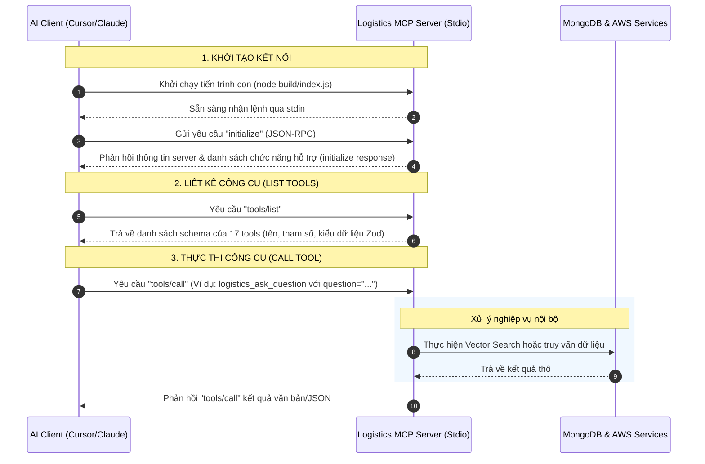
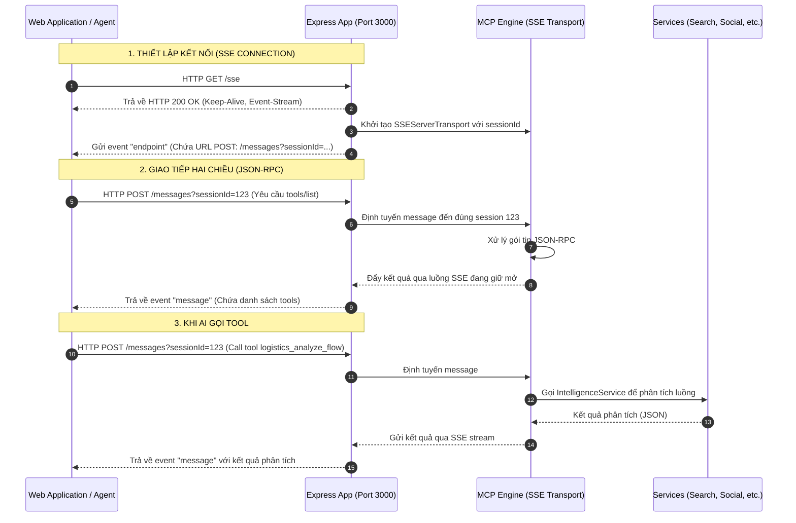
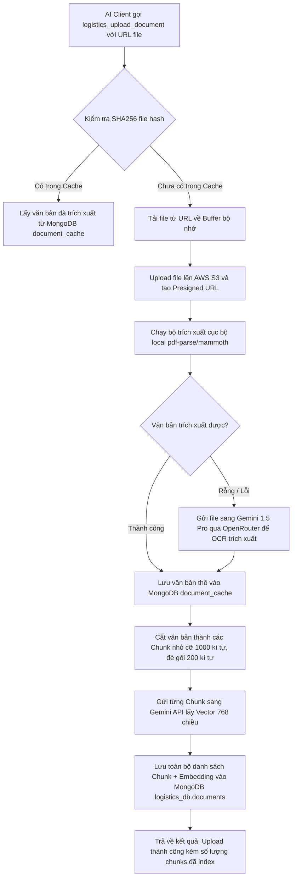

# Kiến Trúc Hệ Thống & Luồng Hoạt Động Của Logistics MCP Server

Tài liệu này giải thích chi tiết về luồng hoạt động của **Model Context Protocol (MCP)** từ Client đến Server, phân tích các công nghệ được sử dụng trong codebase, lý do lựa chọn và nền tảng lý thuyết đằng sau chúng.

---

## 1. Luồng Hoạt Động (Flow) Từ Client Đến Server

Model Context Protocol (MCP) là một chuẩn giao tiếp mở được phát triển bởi Anthropic, cho phép các ứng dụng AI (Client - như Cursor, Claude Desktop, hoặc Web App) kết nối an toàn và gọi các công cụ (Tools), tài nguyên (Resources) hoặc mẫu lệnh (Prompts) từ một máy chủ dịch vụ (Server - như `logistics-mcp-server`).

Hệ thống hỗ trợ song song 2 cơ chế truyền tải (Transports): **Stdio** và **SSE**.

### 1.1. Luồng Hoạt Động Qua Giao Thức Stdio (Chạy Cục Bộ - Local)

Giao thức `stdio` (Standard Input/Output) hoạt động bằng cách Client khởi chạy tiến trình Server như một tiến trình con (child process) và hai bên trao đổi các dòng dữ liệu chuẩn qua định dạng **JSON-RPC 2.0**.



### 1.2. Luồng Hoạt Động Qua Giao Thức SSE (Mạng Từ Xa - Remote HTTP/SSE)

Khi hoạt động ở chế độ SSE (Server-Sent Events), Server chạy một tiến trình Express Web Server độc lập. 
* **SSE (Server-Sent Events)** là công nghệ cho phép Server đẩy dữ liệu (events) về Client theo một chiều thông qua kết nối HTTP liên tục.
* Các gói tin phản hồi hoặc yêu cầu từ Client gửi lên Server sẽ được truyền qua phương thức **HTTP POST**.



---

## 2. Các Công Nghệ Được Sử Dụng & Lý Thuyết Nền Tảng

Dự án tích hợp các công nghệ hiện đại phục vụ việc xây dựng Agentic AI (Tác tử AI) có khả năng kết nối dữ liệu nội bộ (RAG), truy xuất internet, và tương tác mạng xã hội.

```
┌────────────────────────────────────────────────────────┐
│                      AI CLIENT                         │
│             (Cursor / Claude / Web App)                │
└───────────────────────────┬────────────────────────────┘
                            │ (MCP Protocol - Stdio/SSE)
                            ▼
┌────────────────────────────────────────────────────────┐
│                 LOGISTICS MCP SERVER                   │
│   ┌────────────────────────────────────────────────┐   │
│   │               Express Framework                │   │
│   └───────────────────────┬────────────────────────┘   │
│                           ▼                            │
│   ┌────────────────────────────────────────────────┐   │
│   │            McpServer SDK (Zod Schema)          │   │
│   └───────────────────────┬────────────────────────┘   │
│                           │ (Service Layer Dispatch)   │
│                           ▼                            │
│    Search  Document  Intelligence  Execution  Social   │
└──────┬────────┬───────────┬───────────┬─────────┬──────┘
       │        │           │           │         │
       ▼        ▼           ▼           ▼         ▼
  ┌────────┐┌────────┐┌───────────┐┌─────────┐┌────────┐
  │MongoDB ││ AWS S3 ││OpenRouter ││ Gemini  ││DynamoDB│
  │ Vector ││(Storage││(LLM-GPT4o)││Embedding││(Social)│
  └────────┘└────────┘└───────────┘└─────────┘└────────┘
```

---

### 2.1. Model Context Protocol (MCP) SDK
* **Nhiệm vụ trong Code**: Khai báo máy chủ `McpServer`, thiết lập các schema kiểm tra kiểu dữ liệu đầu vào bằng thư viện `Zod` (như `z.string().url()`), kết nối và giải mã các gói tin JSON-RPC.
* **Lý do lựa chọn**:
  - **Chuẩn hóa**: Tránh việc phải tự viết các API REST thủ công cho từng tool. MCP giúp LLM hiểu ngay các tham số cần thiết qua metadata mô tả.
  - **Tương thích cao**: Chỉ cần khởi chạy, server lập tức kết nối được với hệ sinh thái client lớn (Cursor, Claude, Copilot).
* **Lý thuyết**: MCP hoạt động dựa trên đặc tả JSON-RPC 2.0 (Remote Procedure Call). Mỗi yêu cầu bao gồm:
  - `jsonrpc`: "2.0"
  - `method`: Tên phương thức hệ thống (ví dụ: `tools/call`)
  - `params`: Tham số truyền vào (được validate bởi Zod)
  - `id`: Định danh duy nhất để đối chiếu phản hồi không đồng bộ.

---

### 2.2. MongoDB Atlas & Vector Search
* **Nhiệm vụ trong Code**: 
  - Lưu trữ tài liệu gốc và các chunk văn bản (`logistics_db.documents`).
  - Cache văn bản thô để tiết kiệm chi phí (`logistics_db.document_cache`).
  - Thực hiện tìm kiếm ngữ nghĩa với toán tử `$vectorSearch`.
* **Lý do lựa chọn**:
  - Không cần duy trì thêm một cơ sở dữ liệu Vector độc lập (như Pinecone hoặc Chroma), giúp giảm thiểu chi phí quản lý cơ sở hạ tầng.
  - Hỗ trợ cả truy vấn dữ liệu truyền thống (Metadata, filter) lẫn truy vấn Vector trên cùng một cơ sở dữ liệu.
* **Lý thuyết**:
  - **Vector Embedding**: Là quá trình chuyển đổi một chuỗi văn bản thành một mảng số thực có kích thước cố định (ví dụ: 768 chiều). Mảng số này đại diện cho "ý nghĩa ngữ nghĩa" của văn bản.
  - **Tìm kiếm ngữ nghĩa (Semantic Search)**: Thay vì tìm kiếm từ khóa chính xác (Keyword search), hệ thống tính toán khoảng cách hình học (Cosine Similarity hoặc Euclidean Distance) giữa Vector của câu hỏi và Vector của các đoạn văn bản lưu trữ. Đoạn văn nào có khoảng cách gần nhất (góc giữa hai vector nhỏ nhất) sẽ có độ tương quan ngữ nghĩa cao nhất.
  - **Cấu hình chỉ mục Atlas**: MongoDB Atlas sử dụng giải pháp phân cấp HNSW (Hierarchical Navigable Small World) để duyệt nhanh qua hàng triệu vector mà không cần quét toàn bộ cơ sở dữ liệu.

---

### 2.3. Google Gemini Embedding API (`gemini-embedding-001`)
* **Nhiệm vụ trong Code**: Hàm `getEmbedding()` trong `SearchService` gửi request HTTP POST tới Google API để lấy mảng vector 768 chiều đại diện cho văn bản đầu vào.
* **Lý do lựa chọn**:
  - Tốc độ xử lý nhanh, chi phí cực kỳ rẻ (hoặc miễn phí theo hạn mức nhà phát triển).
  - Khả năng hiểu ngôn ngữ tiếng Việt tốt và chất lượng biểu diễn thông tin chất lượng cao.
* **Lý thuyết**: Mô hình Embedding của Gemini được huấn luyện trên khối lượng văn bản khổng lồ đa ngôn ngữ, tối ưu hóa để đưa các khái niệm giống nhau (ví dụ: "vận chuyển đường biển" và "vận tải đại dương") về gần nhau trong không gian vector đa chiều.

---

### 2.4. OpenRouter API & LLMs (GPT-4o, Gemini 1.5 Pro)
* **Nhiệm vụ trong Code**:
  - Dịch vụ RAG (`logistics_ask_question`) gửi tài liệu tham khảo và câu hỏi tới OpenRouter để tạo câu trả lời mạch lạc qua mô hình mặc định (ví dụ: `openai/gpt-4o-mini`).
  - Dịch vụ phân tích tài liệu (`DocumentService`) sử dụng `google/gemini-1.5-pro` làm fallback để đọc và trích xuất bảng biểu từ PDF/Docx khi thư viện local không phân tích được.
* **Lý do lựa chọn**:
  - **Đầu mối duy nhất (Single API)**: Chỉ cần cấu hình một khóa API để gọi tất cả các mô hình lớn nhất thế giới (OpenAI, Anthropic, Google, Meta).
  - Tránh bị khóa chặt vào một nhà cung cấp (Vendor Lock-in). Dễ dàng chuyển đổi mô hình bằng cách thay đổi biến môi trường `OPENROUTER_MODEL`.
* **Lý thuyết**:
  - **Prompt Engineering**: Hệ thống thiết lập các system prompt (Ví dụ: `"You are a Logistics Expert. Answer questions based on the provided context..."`) để hướng dẫn mô hình chỉ tập trung vào nghiệp vụ logistics và không trả lời lan man.
  - **JSON Mode**: Khi phân tích luồng công việc (`logistics_analyze_flow`), hệ thống yêu cầu cấu trúc đầu ra là JSON (`responseFormat: { type: "json_object" }`) giúp code có thể lập tức parse và sử dụng dữ liệu một cách an sau.

---

### 2.5. AWS S3 (Simple Storage Service)
* **Nhiệm vụ trong Code**: Khi tải lên tài liệu mới thông qua `logistics_upload_document`, file buffer được lưu vào AWS S3 và hệ thống tạo ra một liên kết tải xuống có thời hạn (Presigned URL) thọ mệnh 1 giờ (3600 giây).
* **Lý do lựa chọn**:
  - Bảo mật tuyệt đối: Tệp tin không được public rộng rãi ra internet.
  - Khả năng tích hợp: Link Presigned URL bảo mật này sau đó được gửi an toàn cho các mô hình LLM đa phương tiện (như Gemini 1.5 Pro) để tải về và phân tích.
* **Lý thuyết**: **Presigned URL** là cơ chế bảo mật của AWS cho phép chủ sở hữu tài nguyên sử dụng thông tin bảo mật (Access Key / Secret Key) ký mã hóa vào một đường dẫn HTTP. Bất cứ ai có đường dẫn này đều có quyền đọc tài nguyên trong thời hạn cấu hình mà không cần có tài khoản AWS.

---

### 2.6. AWS DynamoDB (Social DDB Table)
* **Nhiệm vụ trong Code**: Quản lý toàn bộ tính năng Social (Tìm kiếm user, kết bạn, tạo phòng chat, lưu thành viên nhóm và ghi lịch sử tin nhắn phòng chat).
* **Lý do lựa chọn**:
  - Tốc độ đọc ghi cực nhanh với độ trễ dưới 10 mili-giây (Single-digit millisecond latency).
  - Mô hình thanh toán theo lượng sử dụng thực tế (Serverless) giúp tiết kiệm tối đa chi phí vận hành.
* **Lý thuyết (Single-Table Design)**:
  - Khác với cơ sở dữ liệu quan hệ (SQL) chia thành nhiều bảng (Users, Friends, Rooms, Messages), dự án này sử dụng mô hình **Single-Table Design** trên một bảng duy nhất (mặc định tên là `Users`).
  - Dữ liệu được phân biệt bởi các cặp khóa chính Partition Key (`PK`) và Sort Key (`SK`).
    - *Tài khoản*: `PK = USER#<id>`, `SK = PROFILE#<id>`
    - *Quan hệ bạn bè*: `PK = USER#<actor_id>`, `SK = FRIEND#<target_id>` (Status: `FRIEND`, `PENDING_SENT`, `PENDING_RECEIVED`)
    - *Nhóm chat*: `PK = ROOM#<room_id>`, `SK = META#<room_id>`
    - *Thành viên nhóm*: `PK = ROOM#<room_id>`, `SK = MEMBER#<user_id>`
  - **Global Secondary Index (GSI)**: Để truy xuất lịch sử trò chuyện trong phòng chat theo thứ tự thời gian, hệ thống sử dụng index phụ `GSI1` với partition key là `GSI1PK = CONVERSATION#<room_id>` để truy vấn (Query) thay vì quét (Scan) toàn bộ bảng, mang lại hiệu năng tối ưu nhất.

---

## 3. Quy Trình Chi Tiết Của Một Kịch Bản Thực Tế (Walkthrough)

Để hiểu rõ cách các công nghệ phối hợp, hãy xem luồng xử lý của Tool `logistics_upload_document`:


- **RAG (Retrieval-Augmented Generation)**: Khi bạn gọi tiếp `logistics_ask_question`, câu hỏi sẽ được chuyển thành vector, MongoDB Atlas dò tìm 3 chunk văn bản có ngữ nghĩa sát nhất, gộp chúng làm ngữ cảnh (Context) rồi gửi sang OpenRouter kèm câu hỏi của bạn. LLM sẽ đọc ngữ cảnh này và trả lời chính xác, tránh hiện tượng "ảo tưởng" (hallucination) của AI.
